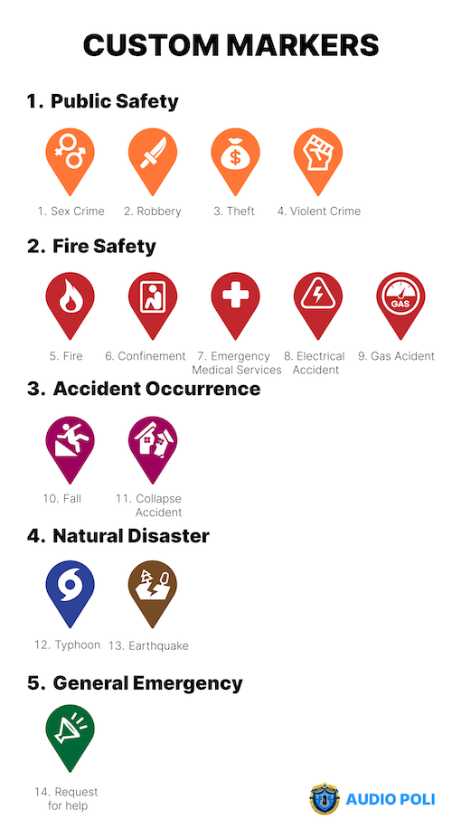
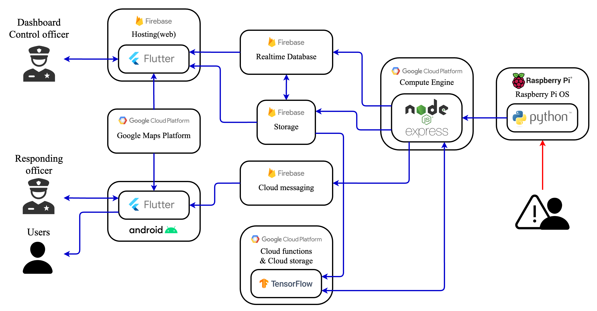

# AudioPoli

---


**AudioPoli** system uses artificial intelligence to analyze voice data from the scene of an incident in real time, capturing screams, emergency signals, and sounds of vandalism to accurately identify the severity and type of incident. If necessary, it automatically notifies the police, fire department, and emergency medical services, and after final review by administrators, sends alert messages to application users near the incident site. This process enables effective and rapid response in areas where reporting is often delayed.

## 🎥 Demo Video

---


**[Video: Audio Poli - GDSC Solution Challenge 2024](https://youtu.be/Q8JWalCFGrE?feature=shared)**

## 🤔 The Problem We Faced

---

We focused on three issues.

First, we want to address situations where people are in danger and unable to call for appropriate help. This could be in a number of different situations: Accidents in remote areas, being caught up in a violent incident and unable to call for help, or being seriously injured and unable to call for help on their own. In these situations, victims may not get the help they need in a timely manner, greatly increasing the risk of a minor incident turning into a major disaster. Our goal is to provide a way for victims to quickly call for help in these risky situations.

Secondly, we are focusing on the problem of responding to incidents that occur in "policing blind spots". By "blind spots" we mean areas where it is difficult to install surveillance equipment such as expensive CCTV due to space limitations or especially economic constraints. In these areas, traditional surveillance methods cannot effectively detect and respond to incidents or accidents. To address this safety vulnerability, we are exploring new approaches to overcome the limitations of traditional surveillance systems. Our goal is to provide the ability to quickly detect incidents and take the necessary action, even in these policing blind spots.

The third problem stems from the limitations of traditional surveillance systems, such as CCTV. These systems rely primarily on visual information to operate. While this can be effective under normal circumstances, in smoky or dark conditions, these systems' ability to monitor is greatly reduced. These conditions make it difficult for the camera's visual sensors to work properly, and as a result, they struggle to capture or analyze their surroundings properly. CCTV systems are also severely limited by physical obstacles. For example, it's impossible to capture what's happening on the other side of a wall, even if it's a thin wall. This means that CCTV has significant limitations when it comes to getting a complete picture of a space. In extreme situations, even covering a camera with a single piece of paper can neutralize the entire system. Our goal is to explore new technological approaches to overcome these limitations.

## ❗️Solution

---

**AudioPoli** provides a solution that meets the modern world's need for rapid response and action in dangerous situations.

First, AudioPoli analyzes voice data from the scene of an incident with artificial intelligence to capture screams, emergency signals, and sounds of damage in real time. This enables victims in remote areas or situations where it is difficult to call for help to call for help in a timely manner, and prevents minor incidents from turning into major disasters. The system automatically reports relevant information about the incident to the police, fire department, and emergency medical services. After final review by administrators, it also sends alert messages to application users near the incident site, minimizing further damage caused by delays in initial response.

Second, to respond to the problem of "blind spots in policing" due to economic and spatial limitations, we built an effective risk detection system at an affordable price. Compared to traditional systems, we provide a surveillance system that is cost-effective and can cover a large area. The system can be applied to a wide range of environments, from urban downtowns to remote areas, through a simple installation process, and can be easily installed, especially in areas with significant economic constraints.

Third, to overcome the limitations of existing hazard detection systems, our system specifically focuses on detecting hazards through the medium of sound. Sound occurs in almost every dangerous situation and contains important information about these situations. By combining emergency signals, screams, human voices, and sounds of damage or crashes with artificial intelligence analytics, we can quickly understand what's happening at the scene of an incident and take appropriate countermeasures tailored to the situation. This overcomes the limitations of traditional visual-based surveillance systems due to field of view restrictions or physical obstacles. As a result, the system provides a protective shield for everyone to live in a safer environment and contributes to the implementation of more comprehensive and effective safety measures.

This approach overcomes the limitations of traditional surveillance systems and contributes to eliminating safety vulnerabilities.

### Process

1. **Sound detection**
    1. Microphone activation: Strategically placed microphones continuously monitor ambient sound. These devices are designed to detect sounds that exceed a predefined decibel threshold, indicating a potential emergency or incident.
    2. Audio capture and transmission: When a sound exceeds the set threshold, the system captures an audio clip and securely transmits it to a server for analysis. This step ensures that potential incidents receive immediate attention without delay.
2. **AI-powered analysis**
    1. Artificial intelligence processing: The transmitted audio is analyzed by an AI algorithm hosted in the cloud service. This AI leverages machine learning models that have been trained on large data sets of various incident-related sounds, such as screams, glass breaking, emergency signals, and more.
    2. Identify incident type: The AI compares the audio clip to the trained model to determine the type of incident it represents. This categorization is based on the following predefined categories, 16 in total, each of which is described below.
        

        

        


        
3. **Dashboard notifications and evaluation**
    1. Dashboard updates: The AI's analysis results are sent to a centralized dashboard, which is immediately updated to reflect new incidents. This dashboard visualizes incidents on a map to give you a real-time view of the situation across multiple locations.
    2. Human verification: To ensure accuracy and prevent false alarms, incidents analyzed by AI undergo a secondary assessment by humans. In this step, an administrator listens to the recorded audio, reviews the AI's categorization, and assesses the severity of the situation based on additional context or available information.
4. **Notifications are sent**
    1. If the operator confirms that the incident is serious, the system proceeds to the next critical step: alert dissemination.
    2. Notify police officers: The system automatically notifies the nearest police station or relevant emergency services. The officer will receive details such as the nature of the incident, location, etc. Officers can use a dedicated application to indicate the time of dispatch and incident resolution and provide real-time updates to the system.
    3. Public notification: At the same time, an alert is sent to the general user application to notify nearby residents or individuals of the ongoing situation. These alerts can help raise and caution to prevent further escalation or damage.

## 🌐 UN-SDGs

---

We have centered our activities around the United Nations' Sustainable Development Goals "11. Sustainable Cities and Communities" and "16. Peace, Justice and Strong Institutions." These choices are based on our fundamental goals of rapid response to incidents and prevention of further incidents.

Specifically, we focused on Goal 11's "11.b: Significantly reduce all forms of violence and its causes of death everywhere" and Goal 16's "16.b: Adopt and implement integrated policies and plans for inclusion, resource efficiency, climate change mitigation and adaptation, and resilience to natural disasters." This choice reflects our commitment to responding quickly to any incident to minimize damage and to prevent further incidents from occurring through integrated disaster risk management.

These goals and specific action plans aim not only to protect against violence and natural disasters, but also to build sustainable and peaceful communities in the long term. By developing and implementing integrated disaster risk management at all levels, we aim to build safer and more inclusive societies.

## 🖇️ Architecture

---





### How it works

1. When the microphone installed on the Raspberry Pi detects a sound above a certain decibel, it records it and sends it to the server.
2. A server developed with Node.js and Express running on the GCP Compute Engine receives and processes data such as the location, time, and recorded voice of the Raspberry Pi.
3. The server internally calls GCP Cloud Functions to receive initial analysis results from the incident classification AI developed with TensorFlow, which has been trained on crime scene data from over 410,000 incidents.
4. The server synthesizes the AI's analysis with existing information and writes it to the Firebase Realtime Database. The original audio file is stored in Firebase Storage, and the Realtime Database contains a URL that references the file.
5. When new incident information is added to the Firebase Realtime Database, the dashboard developed with Flutter detects it and displays the incident information. In the process, it uses GCP's Google Maps Platform to display the incident location on a map.
6. The operator monitoring the dashboard listens to the AI analysis results and the actual voice file to make a final judgment on the severity of the incident. If necessary, the dashboard sends notifications via Firebase Cloud Messaging to officers who need to respond to the scene and to users in the vicinity of the incident.
7. Users who are notified can view incidents that have occurred near them through an application developed with Flutter.
8. The notified officers can use the application to record their arrival and departure times for the incident, and once the incident is handled, the incident will no longer be visible on Google Maps.

## 🛠️ Google Products

---

- `Flutter`
- `Firebase : Realtime Database`
- `Firebase : Storage`
- `Firebase : Cloud messaging`
- `Firebase : Hosting`
- `Google Cloud Platform : Compute Engine`
- `Google Cloud Platform : Cloud Functions`
- `Google Cloud Platform : Google Maps Platform`
- `TensorFlow`

## ▶️ Get Started

---

### Backend [(repo)](https://github.com/GDSC-CAU/AudioPoli-BE)

1. Clone this project

```bash
$ git clone https://github.com/GDSC-CAU/AudioPoli-BE.git
$ cd AudioPoli-BE
```

1. Install npm

```bash
$ npm install
```

1. Set .env

```bash
$ vi .env

GCFURL=*Put your Google Cloud Function URL*
BUCKETURL=*Put your Firebase Storage URL*
SERVICEACCOUNT=*Put your Route of Firebase Adminsdk File*
DBURL=*Put Your Realtime Database URL*
```

1. Start npm

```bash
$ npm start
```

### Frontend - Dashboard [(repo)](https://github.com/GDSC-CAU/AudioPoli-FE-Dashboard)

1. Clone this project

```bash
$ git clone https://github.com/GDSC-CAU/AudioPoli-FE-Dashboard.git
```

1. Set .env

```bash
$ cd AudioPoli-FE-Dashboard
$ cd audiopoli_dashboard/assets
$ vim .env
```

```bash
GOOGLE_MAPS_API_KEY=*Put your Google Maps API KEY*
```

1. Open project with Android Studio
2. Run with Chrome Web

### Frontend - App [(repo)](https://github.com/GDSC-CAU/AudioPoli-FE-Mobile)

1. Clone this project

```bash
$ git clone https://github.com/GDSC-CAU/AudioPoli-FE-Mobile.git
```

1. Open project with Android Studio
2. Run
- In the test app, you can set Officer and Citizen from the button at the top right corner.

### Hardware [(repo)](https://github.com/GDSC-CAU/AudioPoli-HW)

1. Clone this project

```bash
$ git clone https://github.com/GDSC-CAU/AudioPoli-HW.git
$ cd AudioPoli-HW
```

1. Install dependency

```bash
$ sudo apt install python3 python3-pip
$ sudo apt install portaudio19-dev libportaudio2 libopenblas-dev

$ pip3 install sounddevice numpy scipy requests python-dotenv
```

1. set .env

```bash
$ vi src/.env

SERVERURL=*Put your node server URL*
```

1. run

```bash
$ python3 src/app.py
```

### AI [(repo)](https://github.com/GDSC-CAU/AudioPoli-AI)

(This repository is valid only for evaluating)

1. Python ≥ 3.7
2. Clone this project

```bash
$ git clone https://github.com/GDSC-CAU/AudioPoli-AI.git
$ cd AudioPoli-AI
```

1. Install python requirements

```bash
$ pip install -r requirements.txt
```

**Training**

1. Download and extract the dataset (One of the dataset we recommend is [AI-Hub dataset](https://aihub.or.kr/aihubdata/data/view.do?currMenu=115&topMenu=100&aihubDataSe=realm&dataSetSn=170) )
2. The dataset should be in ../testset, and the training set and test set is suggested to match this hierarchy : 

```json
testset
	Training
		label
		orig
	Validation
		label
		orig
```

1. run

```bash
$ python model_fit.py
```

**Inference**

The test is provided to return values only for Google Cloud Function’s platform, but if you want to test with sample data you have, We provide some codes you can simply add below and executing model_fit.py.

```python
# Uncomment one of this 2 lines : 
saved_model_path = './seq_model'
# saved_model_path = 'seq_model.h5'

input_segment = tf.keras.layers.Input(shape=(), dtype=tf.float32, name='audio')
embedding_extraction_layer = hub.KerasLayer(yamnet_model_handle,
                                            trainable=False, name='yamnet')
seq_model = load_model(saved_model_path)
_, embeddings_output, _ = embedding_extraction_layer(input_segment)
serving_outputs = seq_model(embeddings_output)
serving_outputs = ReduceMeanLayer(axis=0, name='classifier')(serving_outputs)
serving_model = tf.keras.Model(input_segment, serving_outputs)
serving_model.save(saved_model_path, include_optimizer=False)
```

## 🧑🏻‍💻 Contributors

---

**상도동 자율 방범대**

**Sangdo Self Defense Force (aka SSDF)**

| Name | Github | Email | Role |
| --- | --- | --- | --- |
| Minsik Kim | https://github.com/pius338 | ppp37686@gmail.com | leader, frontend, database |
| Jihwan Seol | https://github.com/seoljh0722 | seoljh301@gmail.com | artificial intelligence |
| Minseok Chang | https://github.com/minseok128 | minseok128128@gmail.com | hardware, backend, database |
| Yeojin Kim | https://github.com/LUCETE012 | yeojin7010@gmail.com | frontend, backend, database |
